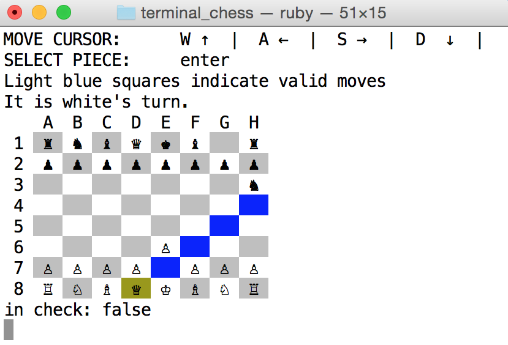

# Terminal Chess


## Description
A game of chess, designed to be played in the terminal. Humans can play against an AI.

## Instructions
* clone the repository
* navigate to the directory from the terminal
* run this command:
```
ruby game.rb
```
* Use W, A, S, D to move left, up, right and down
* enter to select a piece, enter to place it on the board

## Screen Shots



## Implementation 
This game of chess is built entirely in ruby, and designed to be played in the terminal. It utilizes class inheritance to keep code DRY by placing pieces into categories (Steppable, Slidable). The AI is relatively simple. If it is able to place the other player in check, it will. If it is unable to put its opponent in check, it will find its best available capture and capture that. If no captures are available, it will move randomly.


